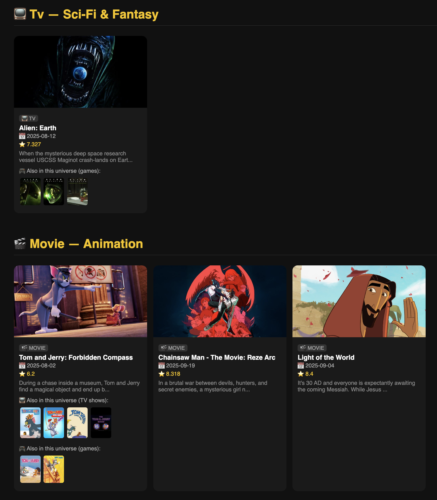
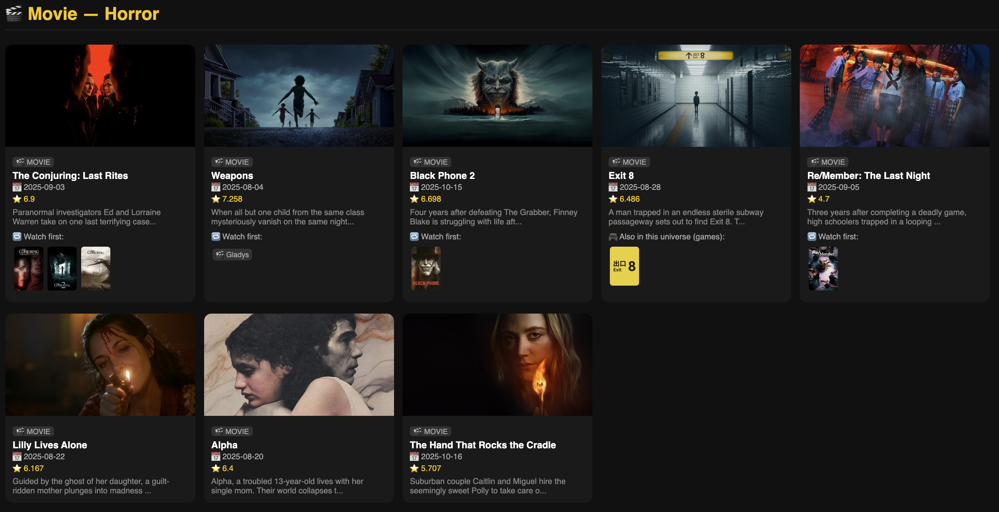

# RewindRec

An open source cross-domain recommendation engine that helps you catch up on a franchise before a new release drops — surfacing related movies, TV shows, and games from the same universe.

> **Disclaimer:** This is a personal research project. It is not affiliated with, endorsed by, or connected to any corporation, streaming service, game publisher, or commercial entity. All data is sourced from public APIs (TMDB, IGDB). Use responsibly.

---

## Screenshots





---

## What It Does

When a new movie or TV show is about to release, RewindRec:
- Fetches upcoming movies and TV shows from TMDB within a configurable time window
- Identifies the franchise/universe using Gemini AI
- Searches for related content across movies, TV shows, and games
- Verifies suggestions using a second Gemini pass — filtering unrelated results
- Groups results by genre, ranked by your preferred genres
- Renders a dark-themed HTML page with posters, links, and cross-domain suggestions

---

## Project Structure

```
RewindRec/
├── main.py                      # Entry point — orchestrates the full pipeline
├── config.py                    # API keys, mock date, environment config
├── requirements.txt
└── src/
    ├── sources/
    │   ├── tmdb_movies.py       # Upcoming movies + collection lookup
    │   ├── tmdb_tv.py           # Upcoming TV shows + past seasons
    │   └── igdb.py              # Game suggestions (requires IGDB credentials)
    ├── agent.py                 # Gemini AI — franchise resolution + verification
    ├── franchise.py             # Cross-domain candidate fetching + verification
    ├── renderer.py              # HTML generation with genre grouping
    └── utils.py
```

---

## Getting Started

### Prerequisites

- Python 3.8+
- TMDB API key (free) — [themoviedb.org/settings/api](https://www.themoviedb.org/settings/api)
- Gemini API key — [aistudio.google.com](https://aistudio.google.com)
- IGDB credentials (optional, for game suggestions):
  - Register a Twitch app at [dev.twitch.tv/console](https://dev.twitch.tv/console)
  - Enable IGDB access to get Client ID + Client Secret

### Installation

```bash
git clone https://github.com/your-username/RewindRec.git
cd RewindRec
python3 -m venv venv
source venv/bin/activate
pip install -r requirements.txt
```

### Configuration

Create a `.env` file in the project root:

```
TMDB_API_KEY=your_tmdb_api_key
GEMINI_API_KEY=your_gemini_api_key

# Optional — enables game suggestions
IGDB_CLIENT_ID=your_twitch_client_id
IGDB_CLIENT_SECRET=your_twitch_client_secret
```

To simulate a past date for testing, set `MOCK_TODAY` in `config.py`:

```python
MOCK_TODAY = "2025-08-01"  # uses /discover/movie with that date range
MOCK_TODAY = None           # live mode, uses /movie/upcoming
```

Adjust the lookahead window in `src/sources/tmdb_movies.py`:

```python
UPCOMING_MONTHS_AHEAD = 3
```

---

## Running

```bash
python3 main.py
```

On startup, you'll be prompted to enter your preferred genres (e.g. `horror, sci-fi, action`). These are used to rank genre groups at the top of the output. Press Enter to skip.

```bash
open output.html
```

---

## How It Works

### Pipeline

```
1. Fetch upcoming movies (TMDB /discover or /movie/upcoming)
   + Fetch upcoming TV shows (TMDB /discover/tv)
        ↓
2. Gemini Call 1 — batch resolve:
   For each title, identify franchise + search terms per domain (movies, tv, games)
        ↓
3. Fetch cross-domain candidates:
   TMDB search for related movies/TV + IGDB search for related games
        ↓
4. Gemini Call 2 — batch verify:
   Filter unrelated candidates. Strict for movies/TV, lenient for games.
   Add a short reason per kept suggestion.
        ↓
5. Render HTML grouped by genre, ranked by user preferences + popularity
```

### Gemini Caching

Gemini responses are cached in `.gemini_cache.json`. Subsequent runs reuse cached results, saving API quota. Delete the file to force a fresh run:

```bash
rm .gemini_cache.json
```

### Notes on Free Tier

Gemini's free tier has daily request limits. If you hit a 429 error:
- Wait for the daily quota to reset (midnight Pacific)
- Or add billing at [aistudio.google.com](https://aistudio.google.com) for higher limits
- The cache means you only pay for each unique batch of titles once

---

## Roadmap

- [ ] Book suggestions via OpenLibrary
- [ ] Personalized watchlist filtering (Letterboxd / Trakt integration)
- [ ] Upcoming games as a first-class feed via IGDB
- [ ] Web UI instead of static HTML

---

## Contributing

Pull requests are welcome. Open an issue first for major changes.

1. Fork the repo
2. Create your branch (`git checkout -b feature/my-feature`)
3. Commit (`git commit -m 'Add my feature'`)
4. Push (`git push origin feature/my-feature`)
5. Open a pull request

---

## License

[MIT](LICENSE)
